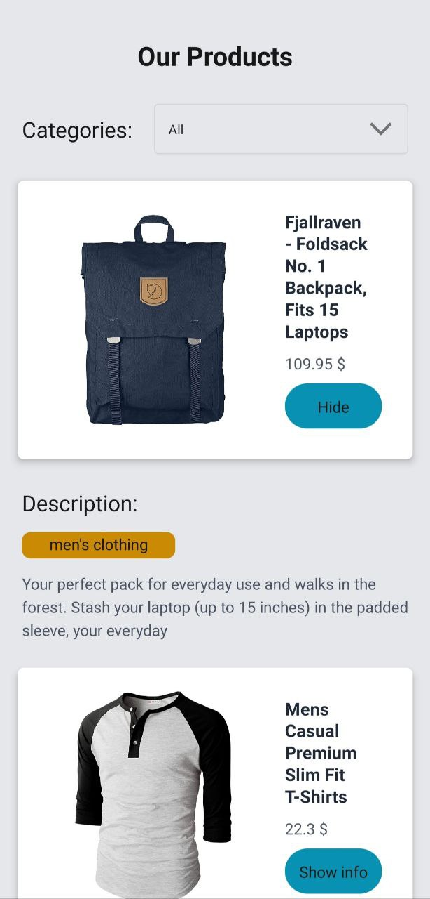
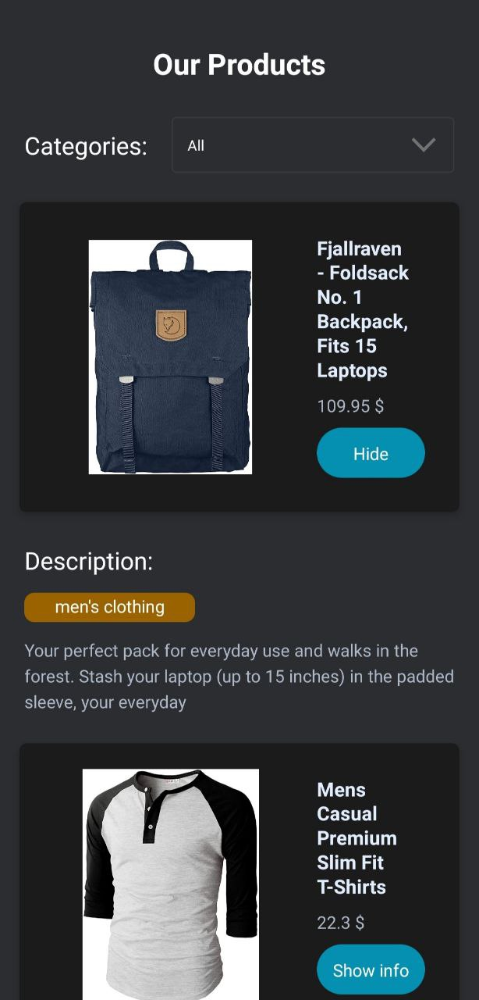

# SearchProduct mobile app (SDK46)

## March 2023

## Usage
+ Virtual emulator or physical device connected
```sh
git clone git@github.com:re-roll/search-product.git
cd search-product
npm i
npm start metro
```

## App
 

